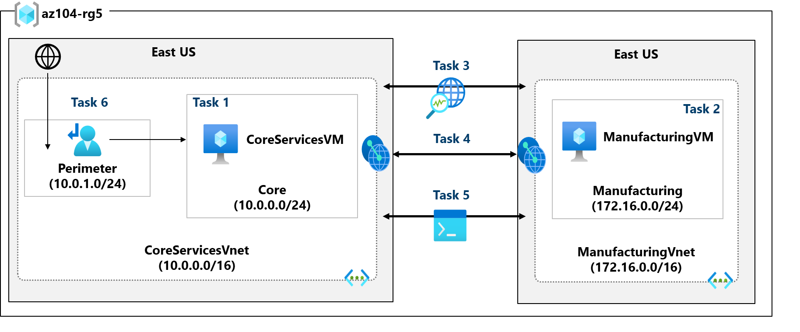
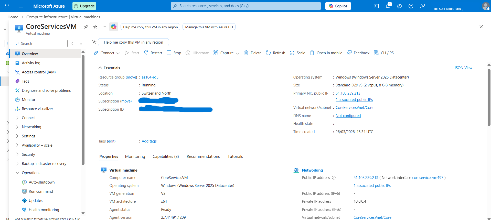
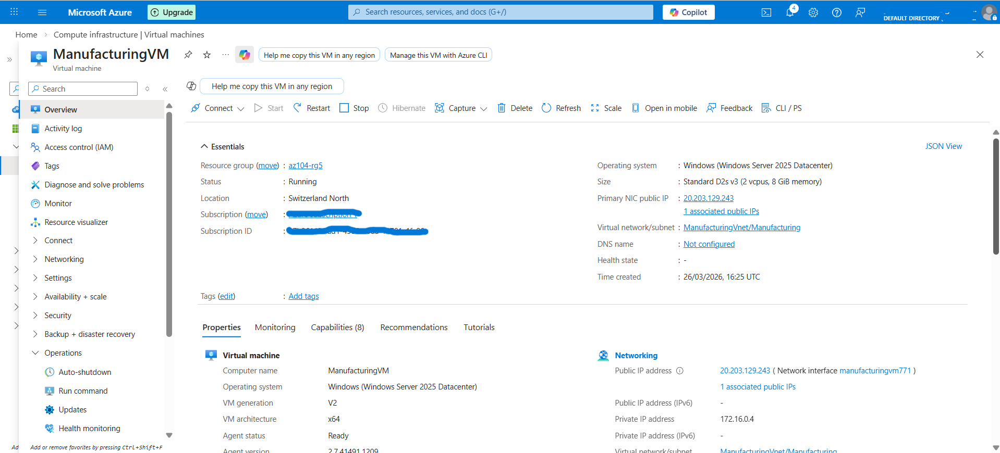
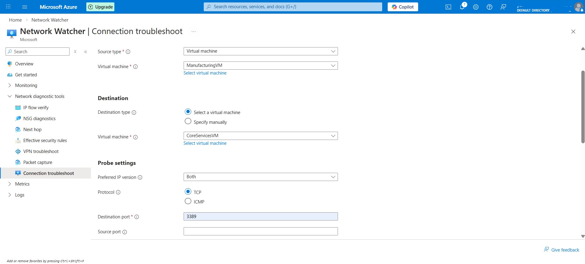
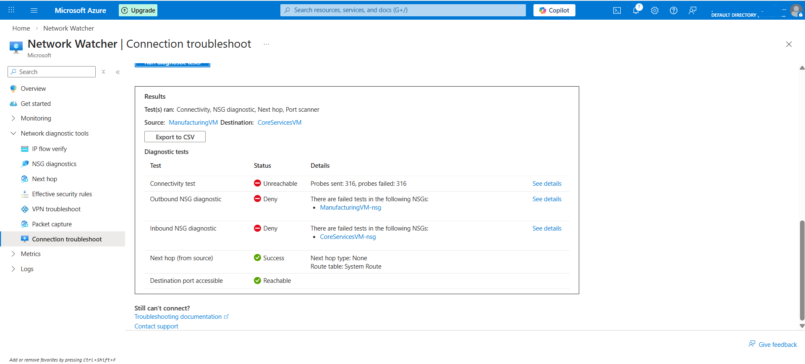
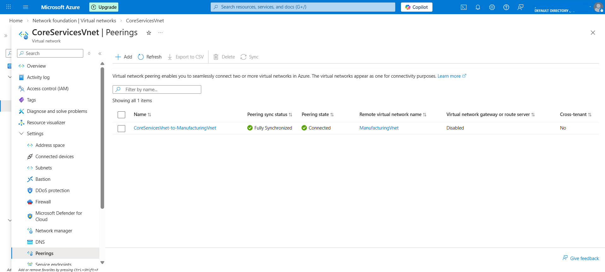
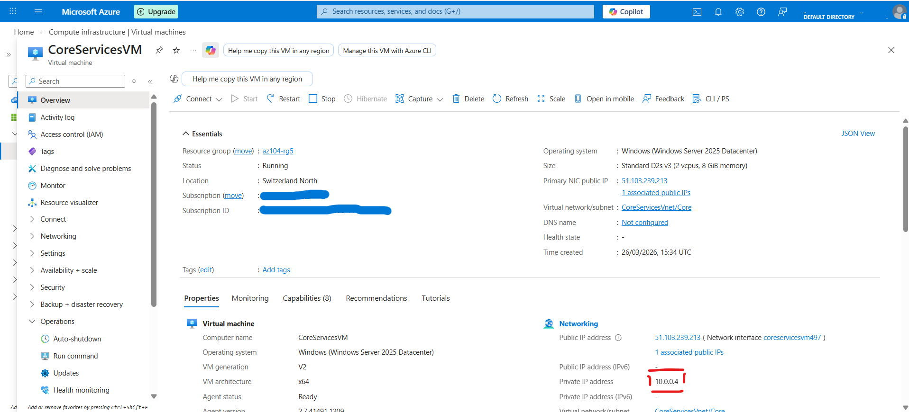
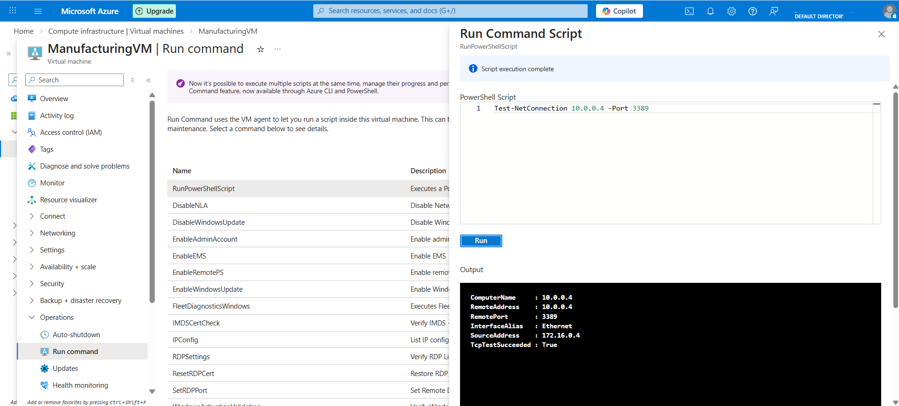
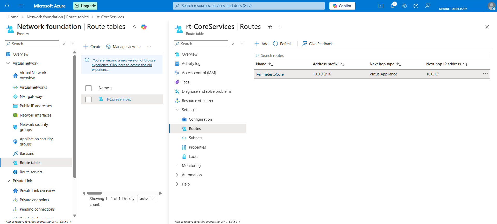

# Azure Intersite Connectivity Lab

## Overview
This project demonstrates how to deploy two isolated Azure virtual networks, validate failed connectivity before peering, configure bidirectional VNet peering, verify successful private communication, and implement a custom route for controlled traffic flow.

The lab simulates a segmented enterprise environment where core services and manufacturing resources are deployed in separate Azure virtual networks and connected through secure, private Azure networking.

## Project Highlights
- Deployed two isolated Azure virtual networks for separate business segments
- Validated failed connectivity before VNet peering
- Configured bidirectional VNet peering between segmented networks
- Verified successful private communication using PowerShell
- Implemented a route table and user-defined route for controlled east-west traffic flow
- Demonstrated a perimeter subnet design for a future network virtual appliance (NVA)

## Technologies Used
- Microsoft Azure
- Azure Virtual Machines
- Azure Virtual Network
- VNet Peering
- Azure Network Watcher
- Azure Route Tables
- User-Defined Routes (UDRs)
- PowerShell

## Project Information
- **Platform:** Microsoft Azure
- **Region:** Switzerland North
- **Resource Group:** `az104-rg5`


## Architecture
The environment includes two virtual networks and one virtual machine in each network.
[View Image](./architecture-diagram.png)



### Core Services Network
- **Virtual Network:** `CoreServicesVnet`
- **Address Space:** `10.0.0.0/16`
- **Subnet:** `Core` → `10.0.0.0/24`
- **Additional Subnet:** `perimeter` → `10.0.1.0/24`
- **Virtual Machine:** `CoreServicesVM`

### Manufacturing Network
- **Virtual Network:** `ManufacturingVnet`
- **Address Space:** `172.16.0.0/16`
- **Subnet:** `Manufacturing` → `172.16.0.0/24`
- **Virtual Machine:** `ManufacturingVM`

### Connectivity Design
1. Two virtual machines are deployed in separate Azure virtual networks.
2. Initial connectivity is tested and confirmed to fail before peering.
3. Bidirectional VNet peering is configured between both networks.
4. Private communication is retested successfully after peering.
5. A route table and custom route are created to support controlled routing toward a future NVA.

## Screenshots

### 1. CoreServicesVM Deployment
[View Image](./screenshot-01-core-vm-create.png)



### 2. ManufacturingVM Deployment
[View Image](./screenshot-02-manufacturing-vm-create.png)



### 3. Connectivity Test Before Peering
[View Image](./screenshot-03-1-connection-unreachable.png)



[View Image](./screenshot-03-2-connection-unreachable.png)



### 4. VNet Peering Status
[View Image](./screenshot-04-1-vnet-peering-connected.png)



[View Image](./screenshot-04-2-vnet-peering-connected.png)


### 5. CoreServicesVM Private IP
[View Image](./screenshot-05-core-private-ip.png)



### 6. Successful Test-NetConnection
[View Image](./screenshot-06-test-netconnection-success.png)



### 7. Route Table and Custom Route
[View Image](./screenshot-07-route-table-custom-route.png)



## Project Structure
```text
.
├── README.md
├── architecture-diagram.png
├── screenshot-01-core-vm-create.png
├── screenshot-02-manufacturing-vm-create.png
├── screenshot-03-1-connection-unreachable.png
├── screenshot-03-2-connection-unreachable.png
├── screenshot-04-1-vnet-peering-connected.png
├── screenshot-04-2-vnet-peering-connected.png
├── screenshot-05-core-private-ip.png
├── screenshot-06-test-netconnection-success.png
└── screenshot-07-route-table-custom-route.png
```

## Deployment Steps

### 1. Deploy CoreServicesVM
Create `CoreServicesVM` in `CoreServicesVnet` with the following configuration:
- Address space: `10.0.0.0/16`
- Subnet: `Core` → `10.0.0.0/24`
- Region: `Switzerland North`
- Public inbound ports: `None`

### 2. Deploy ManufacturingVM
Create `ManufacturingVM` in `ManufacturingVnet` with the following configuration:
- Address space: `172.16.0.0/16`
- Subnet: `Manufacturing` → `172.16.0.0/24`
- Region: `Switzerland North`
- Public inbound ports: `None`

### 3. Validate Initial Isolation
Use Azure Network Watcher to test TCP connectivity from `CoreServicesVM` to `ManufacturingVM` on port `3389`.

Expected result:
- **Unreachable**

### 4. Configure Bidirectional VNet Peering
Create bidirectional VNet peering between:
- `CoreServicesVnet`
- `ManufacturingVnet`

Enable:
- Virtual network access
- Forwarded traffic

Expected result:
- Peering status becomes **Connected**

### 5. Validate Private Connectivity with PowerShell
From `ManufacturingVM`, use **Run command** and execute:

```powershell
Test-NetConnection <CoreServicesVM-private-ip> -Port 3389
```

Expected result:
- Successful private connectivity after VNet peering

### 6. Create a Custom Route
Create an additional subnet:
- `perimeter` → `10.0.1.0/24`

Create a route table:
- `rt-CoreServices`

Add the following custom route:
- **Route Name:** `PerimetertoCore`
- **Destination:** `10.0.0.0/16`
- **Next Hop Type:** `Virtual appliance`
- **Next Hop Address:** `10.0.1.7`

Associate the route table with:
- **Virtual Network:** `CoreServicesVnet`
- **Subnet:** `Core`

## Security Implementation
This lab includes several security-oriented design decisions:

- **Network Segmentation**  
  Core services and manufacturing workloads are deployed in separate Azure virtual networks.

- **No Public Inbound Exposure**  
  Both virtual machines are deployed without public inbound ports.

- **Private Connectivity Validation**  
  Connectivity is tested using Azure Network Watcher and PowerShell over private IP addressing.

- **Controlled East-West Traffic**  
  A user-defined route is configured to direct traffic toward a future virtual appliance.

- **Perimeter Security Design**  
  A dedicated `perimeter` subnet is introduced to support inspection-based traffic control in a future NVA deployment.

- **Forwarded Traffic Readiness**  
  VNet peering is configured to allow forwarded traffic, which supports more advanced routing and security designs.

## Key Learning Outcomes
Through this project, I strengthened practical skills in:

- Azure virtual network design and segmentation
- Virtual machine deployment in isolated networks
- Connectivity troubleshooting with Azure Network Watcher
- Bidirectional VNet peering implementation
- Private IP communication testing with PowerShell
- Route table creation and subnet association
- User-defined route (UDR) implementation
- Perimeter-aware network design in Azure
- Translating a guided lab into portfolio-ready technical documentation

## Why This Project Matters
This project demonstrates more than basic Azure deployment. It shows practical understanding of how segmented enterprise environments are designed, validated, and connected securely. It also reflects awareness of security-focused routing patterns by introducing a perimeter subnet and preparing traffic flow for a future NVA-based inspection model.

## Author
**Yousef Abader**  
Cloud and Infrastructure Learner focused on Azure administration, networking, and secure enterprise environments.

I built this project as part of my hands-on Azure networking practice to strengthen my skills in virtual network connectivity, traffic control, and secure cloud infrastructure design.
